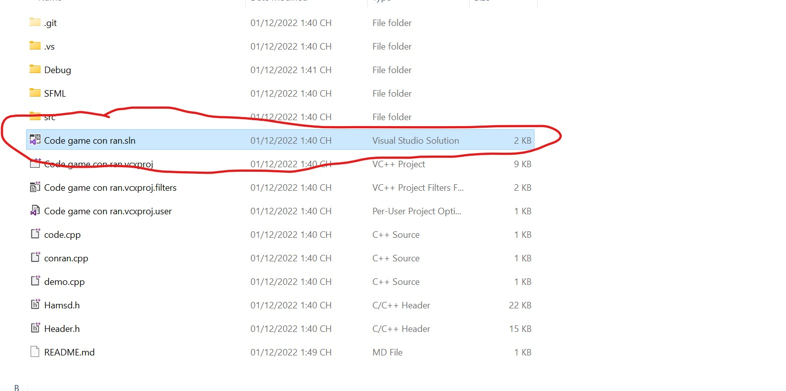
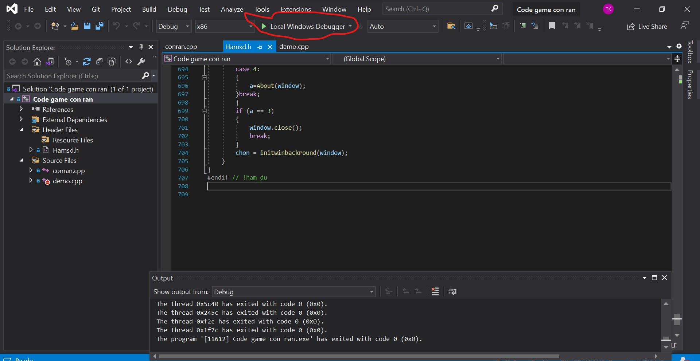
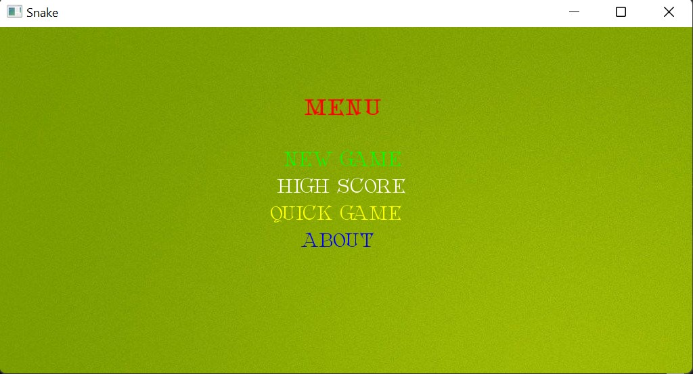
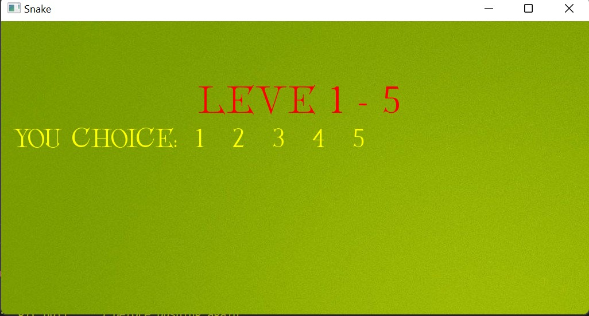
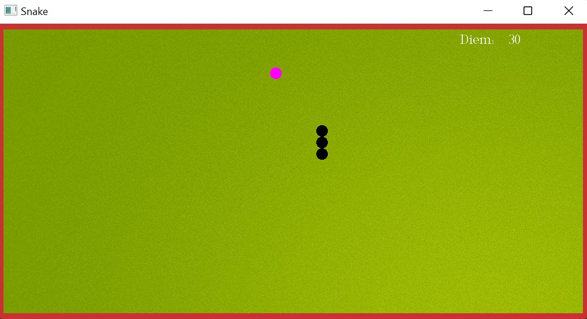

## Game snake
In this project we will make snake game with C++
### My environment

- Using visual studio 2019
- The SFML library needs to be loaded. You can watch and follow at:https://www.youtube.com/watch?v=fOmtYmIAmlU&t=334s

### How to run game?

- First, you need to clone source code:
```
git clone https://github.com/UIT-20521888/SS004.M13.git
```

- Next, open the .sln file in the SS004.M13 folder



- After this step you need to run the code to play the game using the following button



- And finally the game screen appeared



--------------------------------------------------------

- To play the game, please click "New game" then choose the level of play as follows
 


- After selecting the game level is complete. The game screen will appear. And let's start playing the game:

